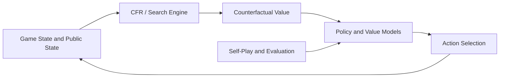

[简体中文](README.md) | [繁體中文](README.zh-TW.md) | [English](README.en.md)

# MasterAI CFR Poker AI Source Code - HUNL Training and Game Research

[](csrc/)
[](main.py)
[](RESPONSIBLE-USE.md)


MasterAI v3.0 is a game-AI research project for **Heads-Up No-Limit Texas Hold'em (HUNL)**. It explores Counterfactual Regret Minimization, self-play reinforcement learning, deep neural networks, counterfactual value estimation, and online strategy re-solving.


> This project is intended for research and education in game theory, imperfect-information games, and multi-agent decision making. Do not use it for activities that violate applicable law, platform rules, or third-party rights.


## Project Scope


| Area | Relevant repository components |
| --- | --- |
| CFR and game trees | `csrc/`, regret data, abstraction, and tree-search components |
| Poker rules | Game logic, action spaces, and state handling under `game/` |
| Counterfactual values | Counterfactual value computation under `cfv/` |
| Reinforcement learning | `rela/`, `supervised_strategy/`, and training entry points |
| Opponents and bots | `robot/`, self-play, and opponent strategy components |
| Service integration | `ipc/`, `proto/`, `redis/`, room logic, and Python services |
| Evaluation | `benchmark/`, `tests/`, and project-reported performance data |


## Core Technology


| Component | Research approach |
| --- | --- |
| Core algorithms | CFR-family methods, regret matching, and average strategies |
| Game type | HUNL, a two-player zero-sum imperfect-information game |
| Learning | Self-play, supervised strategies, and reinforcement-learning components |
| State evaluation | Deep neural networks and counterfactual value estimates |
| Online decisions | Public-state modeling, local search, and continual re-solving concepts |
| Engineering | C++ computation, Python orchestration, IPC, Protobuf, and Redis components |


Tabular CFR has regret-convergence properties under specific assumptions in finite two-player zero-sum games. With function approximation, abstraction, pruning, and online search, convergence and performance depend on the implementation, training process, and evaluation protocol; they cannot be inferred from the algorithm name alone.


## System Structure





```text
benchmark/              Benchmark evaluation
cfv/                    Counterfactual value computation
conf/                   Training and runtime configuration
csrc/                   C++ CFR, game-tree, and low-level computation
game/                   Poker rules and state logic
ipc/                    Inter-process communication
proto/                  Protobuf interfaces
redis/                  Redis integration
rela/                   Reinforcement-learning agent components
robot/                  Opponent and bot strategies
roomlogic/              Room and service logic
supervised_strategy/    Supervised strategy components
tests/                  Tests
main.py                 Training or service entry point
run.py                  Runtime entry point
train.sh                Training script
deploy.sh               Deployment helper
```


## Benchmark Status


The previous README reported the following results:


| Opponent | Project-reported win rate |
| --- | ---: |
| Random Bot | 85% |
| Rule-based AI | 72% |
| CFR Baseline | 58% |


These figures are **project-reported values from the previous repository documentation and were not independently reproduced during this documentation update**. Before citing or comparing them, record the commit, random seeds, opponent implementation, blinds, stack depth, hand count, hardware, confidence intervals, and raw logs. See [BENCHMARKS.md](BENCHMARKS.md) and [REPRODUCIBILITY.md](REPRODUCIBILITY.md).


## Evaluation Workflow


The repository combines C++, Python, shell scripts, Protobuf, Redis, and historical components. Do not run example commands in production before validating dependencies and parameters.


Recommended evaluation sequence:


1. Read `LICENSE`, `License.md`, the configuration directory, and each script, then confirm the applicable license terms with the maintainer.
2. Create an isolated Linux test environment and verify Python, the C++ compiler, CMake, PyTorch, Redis, and third-party library versions.
3. Inspect the real parameters and paths in `main.py`, `run.py`, `train.sh`, and `deploy.sh`.
4. Run minimal tests and small benchmarks before estimating full training resources.
5. Record the commit hash, configuration, seeds, hardware, data, model artifacts, and raw output.


## Screenshots


## Research Resources


- [Benchmark reporting protocol](BENCHMARKS.md)
- [Reproducibility checklist](REPRODUCIBILITY.md)
- [Responsible-use statement](RESPONSIBLE-USE.md)
- [Citation metadata](CITATION.cff)
- [Project website](https://masterai-top.github.io/cfr-poker-ai-masterai/)


## Related MasterAI Poker Projects


- [MasterAI project profile](https://github.com/masterai-top)
- [Texas Hold'em Poker Complete Solution](https://github.com/masterai-top/TexasHoldem-Poker-Complete-Solution)
- [Texas Hold'em Tournament Event Platform](https://github.com/masterai-top/Texas-Holdem-Poker-Tournament-Event-Platform)
- [Texas Hold'em Game Server and Club Platform](https://github.com/masterai-top/Texas-Holdem-Poker-Game-Server-Club-Source-Code)


## License and Responsible Use


The root [LICENSE](LICENSE) does not currently contain a recognizable complete license text, while the repository also has `License.md`. This creates licensing ambiguity. Before use, distribution, or commercial adoption, ask the maintainer to identify and provide the authoritative license.


[RESPONSIBLE-USE.md](RESPONSIBLE-USE.md) is a policy and risk notice, not a software license. Users remain responsible for applicable law, platform rules, privacy, and data protection.


## Contact and Contributions


- [Contribution guide](CONTRIBUTING.md)
- [Security reporting](SECURITY.md)
- Telegram: [@xuzongbin001](https://t.me/xuzongbin001)
- Email: [masterai918@gmail.com](mailto:masterai918@gmail.com)


If this project supports your research, cite it using [CITATION.cff](CITATION.cff) and record the exact commit you used.
