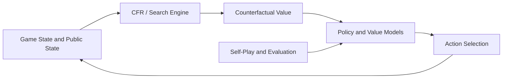

# MasterAI CFR 德州扑克 AI 源码 - HUNL 训练与博弈研究

**简体中文** | [English](README.en.md) | [繁體中文](README.zh-TW.md)

[](csrc/)
[](main.py)
[](RESPONSIBLE-USE.md)


MasterAI v3.0 是面向**单挑无限注德州扑克（Heads-Up No-Limit Texas Hold'em，HUNL）**的博弈 AI 研究项目，围绕反事实遗憾最小化（CFR）、自我博弈强化学习、深度神经网络、反事实价值计算和在线策略重解展开。

> 本项目用于博弈论、非完美信息博弈和多智能体决策研究。请勿将其用于违反适用法律、平台规则或第三方权利的活动。

## 项目范围

| 方向 | 仓库中的相关内容 |
| --- | --- |
| CFR 与博弈树 | `csrc/`、遗憾值文件、状态抽象和树搜索相关模块 |
| 扑克规则 | `game/` 中的牌局逻辑、动作空间与状态处理 |
| 反事实价值 | `cfv/` 中的 Counterfactual Value 计算模块 |
| 强化学习 | `rela/`、`supervised_strategy/` 和训练入口 |
| 对手与机器人 | `robot/`、自我博弈和对手策略模块 |
| 服务集成 | `ipc/`、`proto/`、`redis/`、房间逻辑和 Python 服务脚本 |
| 评估 | `benchmark/`、`tests/` 与项目报告的性能指标 |

## 核心技术

| 模块 | 研究方案 |
| --- | --- |
| 核心算法 | CFR 系列方法、遗憾匹配和策略平均 |
| 博弈类型 | HUNL，两人零和非完美信息博弈 |
| 学习方式 | 自我博弈、监督策略与强化学习组件 |
| 状态评估 | 深度神经网络与反事实价值估计 |
| 在线决策 | 公共状态建模、局部搜索与连续重解思路 |
| 工程实现 | C++ 核心计算、Python 编排、IPC、Protobuf 与 Redis 组件 |

标准表格型 CFR 在满足条件的有限两人零和博弈中具有遗憾收敛性质。引入函数逼近、抽象、剪枝和在线搜索后，具体收敛性与性能取决于实现、训练过程和评估协议，不能仅由算法名称推断。

## 系统结构



```text
benchmark/              基准评估
cfv/                    反事实价值计算
conf/                   训练与运行配置
csrc/                   C++ CFR、博弈树和底层计算
game/                   扑克规则与状态逻辑
ipc/                    进程间通信
proto/                  Protobuf 接口
redis/                  Redis 集成
rela/                   强化学习智能体组件
robot/                  对手与机器人策略
roomlogic/              房间和服务逻辑
supervised_strategy/    监督策略模块
tests/                  测试
main.py                 训练或服务入口
run.py                  运行入口
train.sh                训练脚本
deploy.sh               部署辅助脚本
```

## 基准结果说明

当前 README 曾报告以下结果：

| 对手 | 项目报告胜率 |
| --- | ---: |
| Random Bot | 85% |
| Rule-based AI | 72% |
| CFR Baseline | 58% |

这些数值是**仓库原有文档中的项目报告结果，并非本次整理独立复现的结论**。在引用或比较之前，应补齐提交版本、随机种子、对手实现、盲注、筹码深度、手数、硬件、置信区间和原始日志。详见 [BENCHMARKS.md](BENCHMARKS.md) 与 [REPRODUCIBILITY.md](REPRODUCIBILITY.md)。

## 开始评估

本仓库同时包含 C++、Python、Shell、Protobuf、Redis 和多组历史组件。不要在未确认依赖与参数的情况下直接把示例命令用于生产环境。

建议按以下顺序评估：

1. 阅读 `LICENSE`、`License.md`、配置目录和脚本内容，并向维护者确认适用的授权条款。
2. 建立隔离的 Linux 测试环境，并确认 Python、C++ 编译器、CMake、PyTorch、Redis 和第三方库版本。
3. 检查 `main.py`、`run.py`、`train.sh` 和 `deploy.sh` 的真实参数与路径。
4. 先运行最小测试和小规模 benchmark，再评估完整训练资源。
5. 记录提交哈希、配置、种子、硬件、数据、模型和原始输出。

## 项目截图


## 研究资料

- [基准报告规范](BENCHMARKS.md)
- [可复现性清单](REPRODUCIBILITY.md)
- [负责任使用说明](RESPONSIBLE-USE.md)
- [引用信息](CITATION.cff)
- [项目技术网站](https://masterai-top.github.io/cfr-poker-ai-masterai/)

## MasterAI 德州扑克生态

- [MasterAI 项目主页](https://github.com/masterai-top)
- [德州扑克完整解决方案](https://github.com/masterai-top/TexasHoldem-Poker-Complete-Solution)
- [德州扑克赛事平台](https://github.com/masterai-top/Texas-Holdem-Poker-Tournament-Event-Platform)
- [德州扑克金币大厅](https://github.com/masterai-top/Texas-Hold-em-Points-Lobby)


## 许可证与使用责任

根目录 [LICENSE](LICENSE) 当前缺少可识别的完整许可文本，仓库另有 `License.md`。两者会造成授权歧义；使用、分发或商用前，应由维护者明确唯一适用的许可证并补齐正式文本。

[RESPONSIBLE-USE.md](RESPONSIBLE-USE.md) 是使用政策和风险提示，不构成许可证。使用者仍需遵守适用法律、平台规则、隐私和数据保护要求。

## 联系与贡献

- [贡献指南](CONTRIBUTING.md)
- [安全报告](SECURITY.md)
- Telegram：[@xuzongbin001](https://t.me/xuzongbin001)
- Email：[masterai918@gmail.com](mailto:masterai918@gmail.com)

如果本项目对你的研究有帮助，请在论文或技术报告中按 [CITATION.cff](CITATION.cff) 引用，并记录所使用的提交版本。
