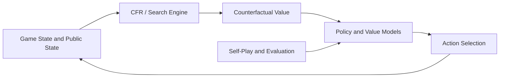

[简体中文](README.md) | [繁體中文](README.zh-TW.md) | [English](README.en.md)

# MasterAI CFR 德州撲克 AI 原始碼 - HUNL 訓練與博弈研究

[](csrc/)
[](main.py)
[](RESPONSIBLE-USE.md)


MasterAI v3.0 是面向**單挑無限注德州撲克（Heads-Up No-Limit Texas Hold'em，HUNL）**的博弈 AI 研究專案，聚焦於反事實遺憾最小化（CFR）、自我博弈強化學習、深度神經網路、反事實價值計算和線上策略重解。


> 本專案用於博弈論、非完美資訊博弈和多智能體決策研究。請勿將其用於違反適用法律、平台規則或第三方權利的活動。


## 專案範圍


| 方向 | 儲存庫中的相關內容 |
| --- | --- |
| CFR 與博弈樹 | `csrc/`、遺憾值檔案、狀態抽象和樹搜尋相關模組 |
| 撲克規則 | `game/` 中的牌局邏輯、動作空間與狀態處理 |
| 反事實價值 | `cfv/` 中的 Counterfactual Value 計算模組 |
| 強化學習 | `rela/`、`supervised_strategy/` 和訓練入口 |
| 對手與機器人 | `robot/`、自我博弈和對手策略模組 |
| 服務整合 | `ipc/`、`proto/`、`redis/`、房間邏輯和 Python 服務指令碼 |
| 評估 | `benchmark/`、`tests/` 與專案報告的效能指標 |


## 核心技術


| 模組 | 研究方案 |
| --- | --- |
| 核心演算法 | CFR 系列方法、遺憾匹配和策略平均 |
| 博弈類型 | HUNL，兩人零和非完美資訊博弈 |
| 學習方式 | 自我博弈、監督策略與強化學習元件 |
| 狀態評估 | 深度神經網路與反事實價值估計 |
| 線上決策 | 公共狀態建模、局部搜尋與持續重解概念 |
| 工程實作 | C++ 核心計算、Python 編排、IPC、Protobuf 與 Redis 元件 |


標準表格型 CFR 在符合條件的有限兩人零和博弈中具有遺憾收斂性質。導入函數近似、抽象、剪枝和線上搜尋後，具體收斂性與效能取決於實作、訓練過程和評估協定，不能僅由演算法名稱推斷。


## 系統結構





```text
benchmark/              基準評估
cfv/                    反事實價值計算
conf/                   訓練與執行設定
csrc/                   C++ CFR、博弈樹和底層計算
game/                   撲克規則與狀態邏輯
ipc/                    行程間通訊
proto/                  Protobuf 介面
redis/                  Redis 整合
rela/                   強化學習智能體元件
robot/                  對手與機器人策略
roomlogic/              房間和服務邏輯
supervised_strategy/    監督策略模組
tests/                  測試
main.py                 訓練或服務入口
run.py                  執行入口
train.sh                訓練指令碼
deploy.sh               部署輔助指令碼
```


## 基準結果說明


先前 README 曾報告以下結果：


| 對手 | 專案報告勝率 |
| --- | ---: |
| Random Bot | 85% |
| Rule-based AI | 72% |
| CFR Baseline | 58% |


這些數值是**儲存庫原有文件中的專案報告結果，並非本次整理獨立重現的結論**。引用或比較前，應補齊提交版本、隨機種子、對手實作、盲注、籌碼深度、牌局數、硬體、信賴區間和原始日誌。詳見 [BENCHMARKS.md](BENCHMARKS.md) 與 [REPRODUCIBILITY.md](REPRODUCIBILITY.md)。


## 開始評估


本儲存庫同時包含 C++、Python、Shell、Protobuf、Redis 和多組歷史元件。未確認相依套件與參數前，請勿將範例命令直接用於正式環境。


建議依照以下順序評估：


1. 閱讀 `LICENSE`、`License.md`、設定目錄和各指令碼內容，並向維護者確認適用的授權條款。
2. 建立隔離的 Linux 測試環境，並確認 Python、C++ 編譯器、CMake、PyTorch、Redis 和第三方函式庫版本。
3. 檢查 `main.py`、`run.py`、`train.sh` 和 `deploy.sh` 的真實參數與路徑。
4. 先執行最小測試和小規模 benchmark，再評估完整訓練資源。
5. 記錄提交雜湊、設定、種子、硬體、資料、模型和原始輸出。


## 專案截圖


## 研究資料


- [基準報告規範](BENCHMARKS.md)
- [可重現性清單](REPRODUCIBILITY.md)
- [負責任使用說明](RESPONSIBLE-USE.md)
- [引用資訊](CITATION.cff)
- [專案技術網站](https://masterai-top.github.io/cfr-poker-ai-masterai/)


## MasterAI 德州撲克生態


- [MasterAI 專案主頁](https://github.com/masterai-top)
- [德州撲克完整解決方案](https://github.com/masterai-top/TexasHoldem-Poker-Complete-Solution)
- [德州撲克賽事平台](https://github.com/masterai-top/Texas-Holdem-Poker-Tournament-Event-Platform)
- [德州积分大厅](https://github.com/masterai-top/Texas-Hold-em-Points-Lobby)


## 授權與使用責任


根目錄 [LICENSE](LICENSE) 目前缺少可識別的完整授權文本，儲存庫另有 `License.md`。兩者會造成授權歧義；使用、散布或商用前，應由維護者明確唯一適用的授權並補齊正式文本。


[RESPONSIBLE-USE.md](RESPONSIBLE-USE.md) 是使用政策和風險提示，不構成授權。使用者仍須遵守適用法律、平台規則、隱私和資料保護要求。


## 聯絡與貢獻


- [貢獻指南](CONTRIBUTING.md)
- [安全回報](SECURITY.md)
- Telegram：[@xuzongbin001](https://t.me/xuzongbin001)
- Email：[masterai918@gmail.com](mailto:masterai918@gmail.com)


如果本專案對你的研究有幫助，請在論文或技術報告中依照 [CITATION.cff](CITATION.cff) 引用，並記錄實際使用的提交版本。
